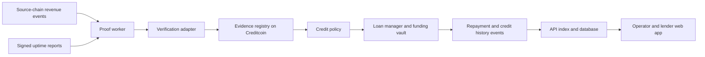

# Architecture

## MVP boundaries

One operator cohort, one supported source chain, one settlement asset, one deterministic policy, and one loan per operator at a time. Creditcoin holds the lending state and credit history. Attestcoin/USC provides the cross-chain evidence path, subject to compatibility validation in milestone 0.

This diagram is the target architecture. RevenueSource, RevenueEvidence, CreditPolicy and LoanManager are implemented locally and tested; live deployment, API/worker integration and browser wallet transactions remain pending. Signed telemetry needs an identified issuer and a trust policy; anchoring a hash only proves a commitment exists. Revenue must be tied to recognized payment events and operator ownership. Transaction inclusion alone does not establish successful payment or business legitimacy. MVP metrics should call out what they measure and what they do not prove.

## Responsibilities

- Web: connect wallet, register operator, inspect evidence provenance, request financing, fund and repay loans, inspect history.
- API: wallet challenge authentication, operator metadata, evidence/job status, indexed portfolio views. Never a source of truth for balances or authorization.
- Worker: fetch recognized source events, wait for finality, request proofs, submit transactions, retry idempotently, index events with reorg handling.
- Domain: canonical operator, evidence, credit decision, and loan types.
- Attestcoin adapter: isolate evolving proof formats and native verifier ABI; live path rejects unimplemented verification.
- Underwriting: integer arithmetic and explicit policy version; mirror or enforce policy in contracts so clients cannot fabricate approval.
- Contracts: RevenueSource and RevenueEvidence bind recognized payments; CreditPolicy reads current-day demo revenue; LoanManager combines one designated lender’s cash custody with fixed-term loans. DemoUSD is a labeled fixed-supply test asset. Separate registration and pooled lender shares remain deferred.

## Minimal records

Operator (wallet, source-wallet ownership, metadata hash); evidence (chain, transaction/event index, asset, period, amount, provenance, status); policy (version, eligibility thresholds, limit formula); loan (principal, fee, maturity, debt, status); repayment (amount, transaction); indexing cursor and proof job (attempts, error, retry time).

## Trust and settlement

Accept evidence only after on-chain verification and application-level event validation. Bind amount, asset, recipient, source contract, source chain, and event identity; reject stale or replayed evidence and count each payment once. Telemetry is supplementary until issuer trust is established. Do not add different assets without a defined valuation source. Underwriting predicts repayment ability; cryptography does not guarantee repayment.

Loans are undercollateralized and lenders can lose principal. Demo with test assets. Specify delinquency/default and loss accounting, block further borrowing on overdue debt, and avoid promising guaranteed returns. Repayment is voluntary on Creditcoin in the MVP; automated capture of off-chain or cross-chain revenue is out of scope. Portable history means queryable, wallet-linked events; it does not imply other lenders automatically recognize the score.
